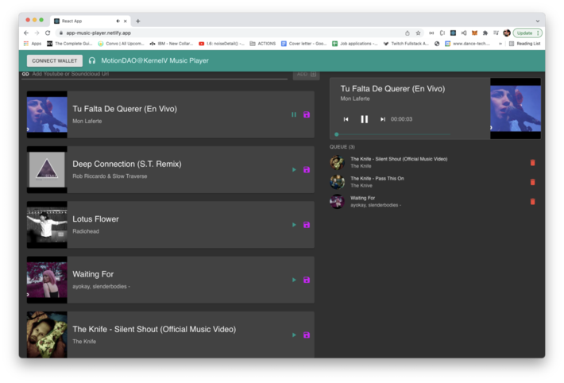

# Marlon Barrios Solano
## software engineer, creative technologist, researcher and educator

## Portfolio
I have been fascinated by complex and networked systems, the web and online-community development. For more than 20 years, as a dancer, digital artist and educator, I have always been interested in building systems with rules and software, creating community platforms and establishing collaborations. I have always been driven by curiosity and my capacity to see the whole and its parts. I have learned to move fast and efficiently from large scale problems, such as networks to the specificities of software implementation. I have lots of collaborative experience envisioning, engineering, coordinating and passion for deploying cutting edge international projects intersecting software, culture and people. I am fascinated by the potential of the blockchain for financial inclusion and innovation. I am a graduate of the General Assembly Software Engineering Immersive Program (December 2021) and a Kernel Fellow Block5 2022. I love creative coding and I teach vipassana meditation and yoga.
## Full Stack Development Projects

### Music Player

I developed this React.js web app for the group to share music adding YouTube muic video and music from SounCloud. The video are added to a list fetching the thunbnail, name and artist data. The user may play them loading the songs in the player and also may create a queue. The personal queue us handled in the browser and the main list and data is managed by Apollo/GraphQR in Hasura/Heroku. You may add some tracks and share the noise!

